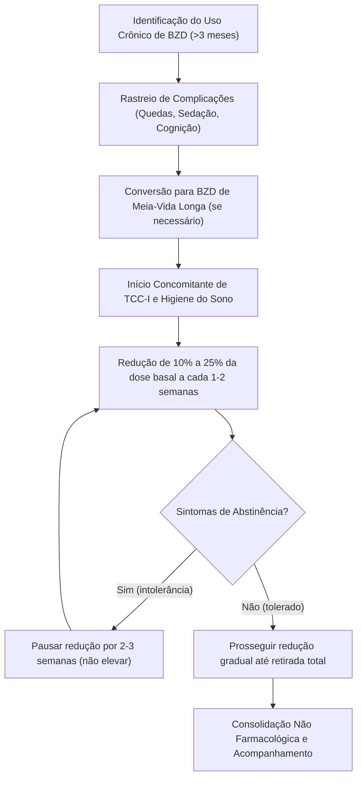

# Desmame Seguro de Benzodiazepínicos e TCC-I na Terceira Idade: Manejo da Dependência Iatrogênica
**Módulo:** Psicoeducação TriagemPsi | Corte 800 Medicina | Caminhos Campinas B2G  
**Chancela Médica:** Dr. José Ribamar Fernandes Saraiva Junior (CRM-RS 29349 · RQE 30038)  
**Referência Principal:** SARAIVA JUNIOR, J.R.F.; DIEHL, A.A. *Utilização de substâncias psicoativas em idosos e o trabalho da equipe interdisciplinar*. In: Adicções na Terceira Idade. Passo Fundo: Ed. Berthier, 2014.

---

## 1. Visão Geral & Conceitos-Chave

A prescrição crônica de benzodiazepínicos (BZDs) em idosos configura a dependência química iatrogênica mais prevalente e subdiagnosticada na Atenção Primária à Saúde e na prática ambulatorial. Inicialmente indicados para quadros transitórios de ansiedade ou insônia aguda, fármacos com ação agonista alostérica no receptor GABA-A (como clonazepam, diazepam, lorazepam e bromazepam) frequentemente têm suas receitas renovadas por anos a fio sem reavaliação clínica estruturada. Com o envelhecimento, alterações fisiológicas profundas na farmacocinética — aumento proporcional do tecido adiposo com elevação do volume de distribuição de drogas lipossolúveis, redução da água corporal total e declínio da depuração hepática pelo citocromo P450 — prolongam a meia-vida desses compostos, transformando doses habituais em níveis séricos potencialmente tóxicos.

No sistema nervoso central envelhecido, a hipersensibilidade farmacodinâmica dos receptores GABAérgicos associa-se a um risco exponencial de eventos adversos graves. A sedação diurna residual e a lentificação psicomotora correlacionam-se diretamente com o aumento do risco de quedas da própria altura, com consequentes fraturas de colo de fêmur e perda permanente de autonomia funcional. Paralelamente, o bloqueio na consolidação mnemônica e a sedação crônica mimetizam ou aceleram quadros de síndrome demencial, levando famílias e profissionais desavisados a rotularem errônea e precocemente o paciente como portador de demência degenerativa irreversível, quando o quadro de base é uma encefalopatia crônica medicamentosa reversível.

O enfrentamento desse cenário exige a desconstrução do etarismo médico ("na idade dele não vale a pena mexer") e o entendimento de que a suspensão abrupta do BZD é expressamente contraindicada pelo alto risco de síndrome de abstinência grave (tremores, insônia de rebote, delirium e convulsões epileptogênicas). O padrão-ouro de conduta preconizado pelo Dr. Saraiva alicerça-se na aliança interdisciplinar (médico prescritor, enfermagem, farmacêutico clínico e suporte familiar), na titulação decrescente lenta e no emprego concomitante da Terapia Cognitivo-Comportamental para Insônia (TCC-I), capacitando o idoso a reencontrar o ritmo circadiano sem a muleta química.

---

## 2. Protocolo Prático & Conduta

### 2.1 Algoritmo de Avaliação e Desmame Gradual (Protocolo Escalonado)

#### Passo 1: Pactuação e Aliança Terapêutica
- Conversa aberta com o paciente e familiares sem julgamento moral: explicar que o remédio "perdeu o efeito protetor" e passou a causar desequilíbrio e esquecimentos.
- Pactuação de calendário escrito: meta de redução gradual em 8 a 16 semanas.

#### Passo 2: Equivalência de Dose e Desmame Fracionado
- Quando o paciente estiver em uso de BZD de meia-vida curta ou intermediária com sintomas intermitentes de abstinência (ex: alprazolam, lorazepam), considerar conversão proporcional para BZD de meia-vida longa (ex: diazepam) antes de iniciar a redução.
- **Ritmo de Desmame:** Redução de 10% a 25% da dose original a cada 7 a 14 dias. Nos últimos 25% da dose, estender os intervalos para 2 a 4 semanas.
- Se surgirem sintomas de abstinência moderados, **manter a dose atual estabilizada** por 2 semanas; nunca retornar à dose máxima anterior.

#### Passo 3: Intervenção Não Farmacológica — Componentes da TCC-I
1. **Controle de Estímulos:** Cama restrita a dormir e intimidade conjugal; sair do quarto se não adormecer em 20 minutos; horário inflexível de acordar todas as manhãs.
2. **Restrição de Tempo na Cama:** Ajustar a janela de permanência na cama à média real de horas dormidas adicionada de 30 minutos (eleva a pressão homeostática de sono).
3. **Higiene Circadiana:** Exposição à luz solar matinal direta por 20 minutos; cessação absoluta de cafeína após as 14h; banho morno 90 minutos antes do repouso.
4. **Respiração Guiada (4-7-8):** Inspiração nasal em 4 segundos, sustentação em 7 segundos e expiração oral lenta em 8 segundos para quebra de hiperativação autonômica simpática.

---

## 3. Caso Clínico / Cenário Real

### 3.1 Identificação e Anamnese
**Paciente:** D. Eunice, 76 anos, viúva há 3 anos, aposentada, reside com a filha.  
**Queixa Principal:** "Vim só renovar minha receita do clonazepam, doutor. Tomo há 12 anos e não durmo sem ele."  
**História da Moléstia Atual:** A filha relata que a mãe apresenta lentidão motora progressiva nos últimos 6 meses, sonolência excessiva durante a tarde e dois episódios de quedas no trajeto até o banheiro à noite, sem fraturas aparentes. Notou também esquecimentos repetidos de nomes de familiares e datas. Há dois meses, por insistência da filha, tentaram suspender a medicação de forma abrupta: D. Eunice apresentou sudorese fria, taquicardia, tremores nas mãos, choro imotivado e pânico de não dormir, o que fez a família retomar a dose habitual no segundo dia.  
**Antecedentes Médicos:** Hipertensão arterial sistêmica em uso de losartana 50mg/dia e anlodipino 5mg/dia. Nega histórico de etilismo.

### 3.2 Exame Clínico & Investigação Complementar
- **Estado Geral:** Lúcida, orientada no tempo e espaço, marcha lentificada com base discretamente alargada.
- **Pressão Arterial:** 130/80 mmHg (deitada) / 110/70 mmHg (em pé — hipotensão ortostática leve).
- **Rastreio Cognitivo:** Mini-Exame do Estado Mental (MEEM) com escore de 24/30 (prejuízo em memória de evocação e cálculo).
- **Escala de Sonolência de Epworth:** 14/24 (sonolência diurna patológica).
- **Exames Laboratoriais:** Função renal, eletrólitos, TSH e vitamina B12 rigorosamente normais.

### 3.3 Armadilhas Diagnósticas Evitadas
1. *Diagnosticar Demência de Alzheimer Precoce:* Atribuir os lapsos e o escore limítrofe no MEEM a uma doença degenerativa primária, ignorando o efeito bloqueador de memória anterógrada do BZD em uso crônico.
2. *Interpretar a Abstinência como Retorno da Ansiedade Primária:* Achar que o mal-estar após 48h de interrupção comprova que "ela realmente precisa do remédio", quando é a prova inconteste de dependência física instalada.
3. *Substituir por Antipsicótico Sedativo (ex: Quetiapina):* Trocar um fármaco por outro sem implementar a TCC-I, apenas substituindo o mecanismo de dano e aumentando o risco cardiovascular e metabólico.

### 3.4 Conduta Recomendada
1. **Pactuação Interdisciplinar:** Plano compartilhado com D. Eunice e a filha, agendando desmame gradual do Clonazepam ao longo de 12 semanas.
2. **Cronograma Terapêutico:** Redução de 0,5 mg a cada 14 dias, com monitoramento semanal da pressão arterial e qualidade do sono pela equipe de enfermagem da UBS/Clínica.
3. **Instituição Imediata de TCC-I:** Higiene do sono, luz solar matinal e proibição de cochilos diurnos prolongados.
4. **Resultado em 14 Semanas:** Suspensão total do BZD; normalização do MEEM para 28/30; cessação completa de quedas e retorno à autonomia nas atividades instrumentais de vida diária.

---

## 4. Banco de Questões (Quiz — Padrão TRI 3PL)

### Questão 1 (Parâmetro b = -0.85 — Fácil)
Mulher de 74 anos em uso de clonazepam 2 mg/noite há 10 anos relata que tentou parar o medicamento por conta própria e, após 36 horas, apresentou insônia intensa, tremores finos nas mãos, sudorese e ansiedade avassaladora. Qual é a interpretação fisiopatológica correta para esse quadro?
- **A)** Trata-se de recidiva imediata do transtorno de ansiedade generalizada primário.
- **B)** Configura síndrome de abstinência a benzodiazepínicos, evidenciando dependência física iatrogênica instalada.
- **C)** Trata-se de efeito nocebo secundário à insegurança psicológica da paciente.
- **D)** É uma manifestação psicótica reativa indicativa de início de quadro demencial.
> **Gabarito:** **B**  
> **Justificativa:** O aparecimento agudo de hiperatividade autonômica (sudorese, taquicardia, tremores) e insônia de rebote após a interrupção abrupta de BZD usado cronicamente é a definição clínica da síndrome de abstinência, comprovando neuroadaptação e dependência física, e não simples recidiva psicológica.

---

### Questão 2 (Parâmetro b = 0.20 — Médio)
Em idosos, qual alteração farmacocinética relacionada ao processo biológico de envelhecimento contribui decisivamente para o aumento da meia-vida de eliminação de benzodiazepínicos lipofílicos como o diazepam?
- **A)** Aumento da taxa de filtração glomerular renal.
- **B)** Aumento da proporção relativa de tecido adiposo corpóreo e redução da depuração hepática oxidativa.
- **C)** Elevação dos níveis séricos basais de albumina plasmática.
- **D)** Redução da sensibilidade dos receptores GABA-A encefálicos.
> **Gabarito:** **B**  
> **Justificativa:** O envelhecimento cursa com aumento proporcional de gordura corporal, ampliando o volume de distribuição de drogas lipossolúveis (que ficam acumuladas nos tecidos), somado ao declínio da função oxidativa dos microssomos hepáticos, prolongando a meia-vida e provocando sedação cumulativa.

---

### Questão 3 (Parâmetro b = 0.65 — Médio-Difícil)
Durante o planejamento da retirada de benzodiazepínico em uma paciente geriátrica de 78 anos em uso de alprazolam 1,5 mg/dia há 8 anos, qual é a estratégia terapêutica mais segura recomendada pelas diretrizes clínicas?
- **A)** Suspensão abrupta imediata sob monitoramento de eletroencefalograma.
- **B)** Substituição mandatória por neuroléptico incisivo em altas doses.
- **C)** Desmame gradual com redução de 10% a 25% a cada 1 a 2 semanas, associado a suporte de TCC-I e higiene do sono.
- **D)** Manutenção da prescrição por tempo indeterminado, dado que os riscos da retirada superam os riscos da continuidade.
> **Gabarito:** **C**  
> **Justificativa:** A redução lenta e progressiva em equipe multiprofissional previne convulsões e descompensação autonômica, permitindo a readaptação fisiológica, enquanto as intervenções não farmacológicas (TCC-I) tratam a causa subjacente da insônia.

---

### Questão 4 (Parâmetro b = 1.10 — Difícil)
Idoso de 81 anos apresenta quadro de quedas de repetição e comprometimento cognitivo com prejuízo na evocação e atenção. Encontra-se polimedicado, incluindo diazepam 10 mg/noite prescrito há 15 anos. Ao propor o desmame do BZD, a família expressa receio de que a paciente "enlouqueça sem dormir". Qual argumento médico fundamenta a decisão de retirar o medicamento?
- **A)** O BZD perde o efeito hipnótico após poucas semanas devido à tolerância e passa a atuar predominantemente como neurotóxico, piorando a cognição e elevando o risco de fraturas por quedas.
- **B)** Os benzodiazepínicos são fármacos cardiotóxicos diretos que causam infarto agudo do miocárdio após 5 anos de uso.
- **C)** A insônia na velhice é uma condição incurável que não deve receber qualquer tipo de manejo.
- **D)** O diazepam impede a absorção de todos os nutrientes entéricos essenciais.
> **Gabarito:** **A**  
> **Justificativa:** A tolerância farmacológica ao efeito sedativo desenvolve-se rapidamente, restando apenas os efeitos colaterais deletérios: ataxia, lentificação dos reflexos protetores, amnésia anterógrada e sonolência diurna com risco de acidentes graves.

---

### Questão 5 (Parâmetro b = 1.55 — Muito Difícil / TRI Alta Discriminação)
Homem de 69 anos em processo de desmame de benzodiazepínico atinge a redução de 50% da dose inicial no 30º dia de protocolo. Passa a queixar-se de ansiedade moderada e aumento da latência para iniciar o sono (demora 45 minutos para adormecer). Não há sinais de hiperatividade autonômica grave, febre ou confusão mental. Qual é a conduta médica correta segundo o protocolo interdisciplinar do Dr. Saraiva?
- **A)** Retornar imediatamente à dose máxima inicial de BZD e abandonar o desmame.
- **B)** Pausar novas reduções, estabilizando a dose atual por 2 a 3 semanas, e intensificar as técnicas de TCC-I antes de prosseguir.
- **C)** Associar imediatamente um segundo benzodiazepínico potente de ação ultra-rápida.
- **D)** Indicar internação psiquiátrica em regime fechado para contenção física.
> **Gabarito:** **B**  
> **Justificativa:** Em caso de queixas toleráveis durante o desmame, a conduta técnica consiste em estabilizar o patamar atual para acomodação dos receptores neuronais (sem elevar a dose) e reforçar as intervenções comportamentais da TCC-I, retomando a diminuição quando a estabilidade clínica for reestabelecida.

---

## 5. Decks de Repetição Espaçada (Flashcards FSRS v6)

### Card 1
* **Frente (Pergunta):** Qual é o principal mecanismo farmacológico dos benzodiazepínicos e por que perdem a eficácia hipnótica após poucas semanas de uso contínuo?
* **Verso (Resposta):** Atuam como moduladores alostéricos positivos dos receptores GABA-A, potencializando a ação inibitória do GABA. A perda do efeito hipnótico decorre da tolerância farmacodinâmica (dessensibilização e internalização dos receptores).

---

### Card 2
* **Frente (Pergunta):** Por que os benzodiazepínicos lipofílicos apresentam meia-vida de eliminação muito prolongada em pacientes idosos?
* **Verso (Resposta):** Devido ao aumento fisiológico da adiposidade corporal no envelhecimento (que amplia o volume de distribuição dos fármacos lipossolúveis) combinado à redução da depuração metabólica hepática (oxidação microsomal).

---

### Card 3
* **Frente (Pergunta):** Quais são os dois riscos clínicos mais graves associados ao uso prolongado de BZDs na terceira idade?
* **Verso (Resposta):** 1) Quedas da própria altura com fraturas graves (fêmur); 2) Declínio cognitivo e amnésia anterógrada mimetizando pseudodemência medicamentosa.

---

### Card 4
* **Frente (Pergunta):** O que diferencia a síndrome de abstinência de BZD da recidiva do transtorno de ansiedade primário?
* **Verso (Resposta):** A abstinência apresenta início abrupto após redução/suspensão, acompanhada de sinais de hiperatividade autonômica franca (tremores, sudorese, taquicardia, hiperacusia) e insônia de rebote desproporcional.

---

### Card 5
* **Frente (Pergunta):** Qual é a velocidade padrão recomendada para o desmame gradual de benzodiazepínicos em idosos?
* **Verso (Resposta):** Redução de 10% a 25% da dose basal a cada 1 a 2 semanas, estendendo o intervalo para 2 a 4 semanas na etapa final dos últimos 25% da dosagem.

---

### Card 6
* **Frente (Pergunta):** Por que a suspensão abrupta de benzodiazepínicos é expressamente contraindicada na prática médica?
* **Verso (Resposta):** Porque pode desencadear crises convulsivas epileptogênicas, estado de mal epiléptico, Delirium de abstinência grave e arritmias autonômicas potencialmente fatais.

---

### Card 7
* **Frente (Pergunta):** Quais são os quatro componentes essenciais da TCC-I preconizados para substituir o tratamento farmacológico da insônia?
* **Verso (Resposta):** 1) Controle de estímulos; 2) Restrição do tempo na cama; 3) Higiene do sono circadiana; 4) Reestruturação cognitiva e relaxamento fisiológico (respiração 4-7-8).

---

### Card 8
* **Frente (Pergunta):** Na técnica de controle de estímulos da TCC-I, qual é a orientação para o paciente que não consegue conciliar o sono após deitar?
* **Verso (Resposta):** Levantar-se da cama se permanecer acordado após aproximadamente 20 minutos, deslocar-se para um ambiente escuro e calmo com atividade relaxante e só retornar à cama quando sentir sono real.

---

### Card 9
* **Frente (Pergunta):** Qual é o papel da equipe interdisciplinar no desmame de BZDs segundo o modelo clínico do Dr. Saraiva (2014)?
* **Verso (Resposta):** O médico programa e titula a retirada; a enfermagem monitora os parâmetros clínicos e sinais de abstinência; o farmacêutico vigia interações medicamentosas; e a família sustenta a rotina de TCC-I no domicílio.

---

### Card 10
* **Frente (Pergunta):** O que deve ser feito se o paciente idoso apresentar ansiedade leve a moderada durante uma das etapas do desmame escalonado?
* **Verso (Resposta):** Pausar a redução e manter a dose atual estabilizada por 2 a 3 semanas sem aumentá-la, reforçando as técnicas comportamentais de TCC-I até a readaptação clínica.
