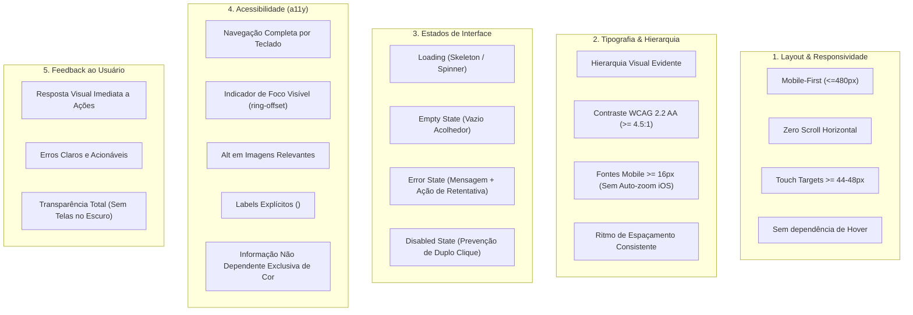

# 09. Checklist Vivo de Qualidade de Interface (UI Quality Baseline) — TriagemPsi

> **Derivado da Skill:** [.agents/skills/ui-quality-baseline/SKILL.md](file:///mnt/armazenamento/Projetos/triagem-medica/.agents/skills/ui-quality-baseline/SKILL.md)  
> **Versão de Conformidade:** v1.30.0 (Atualizada com Cockpit de Psicoeducação `/materiais` e Multi-Tenant)

Este documento estabelece o **Checklist Vivo e Permanente** de qualidade de interface para o ecossistema TriagemPsi (Saraiva Clínica de Psiquiatria e Instituto Lumina de Saúde Mental).

> [!IMPORTANT]
> **Regra de Ouro da Interface:** Nenhuma tela, fluxo ou componente interativo pode ser considerado concluído ("done") sem passar integralmente por todos os itens deste checklist. As diretrizes são stack-agnósticas e devem ser cumpridas tanto em ambiente móvel quanto em desktop.

---

## 1. Os 5 Pilares Não Negociáveis do Baseline

---

## 2. Matriz Viva de Verificação por Tela e Módulo

### Legenda:
*  **Aprovado**: Cumpre integralmente o critério.
* ⚠️ **Atenção / Débito**: Funciona, mas possui refinamento ergonômico recomendado.
* ❌ **Crítico / Blocker**: Violação direta que compromete a usabilidade ou conformidade.

| Critério | Triagem do Paciente (`$slug.triagem.tsx`) | Cockpit Médico (`painel.$id.tsx` / `painel.index`) | Cockpit Psicoeducação (`materiais.tsx`) | Portal do Paciente (`portal.tsx`) | Admin & Gestão (`admin.tsx`) |
| :--- | :---: | :---: | :---: | :---: | :---: |
| **1.1 Mobile-First (≤480px)** |  (Testado iPhone SE / 14) |  (Cards móveis + Sheet) |  (Grid adaptativo 1-3 colunas) |  (Container fluido) |  (Colapsável lg:grid) |
| **1.2 Zero Overflow-X** |  (Contido) |  (Tabela com scroll isolado) |  (Contido) |  (Contido) |  (Tabs com scroll interno) |
| **1.3 Touch Targets (≥44px)** |  (Botões min-h-14 / 44px) |  (Ações rápidas ≥44px) |  (Botões cópia/print ≥44px) |  (Botões h-11 / 44px) |  (Botões min-h-11) |
| **1.4 Sem Dependência de Hover** |  (Ações explícitas por toque) |  (Ações com clique direto) |  (Ações visíveis por card) |  (Ações visíveis) |  (Botões com label) |
| **2.1 Hierarquia Visual** |  (H1/H2 padronizados) |  (Tipografia com peso claro) |  (Categorias com badges) |  (H1 serif + tags) |  (Banner hero + cards) |
| **2.2 Contraste WCAG AA** |  (Esmeralda/Slate ≥4.5:1) |  (Tons conformes AA) |  (Tons clínicos e legíveis) |  (Card de crise de alto contraste) |  (Badges e botões nítidos) |
| **2.3 Font-Size Mobile (≥16px)** |  (text-base sem auto-zoom) |  (text-base em filtros/inputs) |  (text-base em busca/inputs) |  (text-base) |  (text-base em campos) |
| **3.1 Loading State** |  (Progress bar / submitting) |  (Skeletons animados) |  (Transição instantânea) |  (Skeletons animados) |  (Spinners de ação) |
| **3.2 Empty State** | N/A (Formulário) |  (Empty card + limpar filtros) |  (Busca vazia acolhedora) |  (Empty card acolhedor + CTA) |  (Lista com chamada de cadastro) |
| **3.3 Error State + Retry** |  (Card de erro com retry) |  (Card com tentar novamente) |  (Recuperação graciosa) |  (Card com tentar novamente) |  (Feedback toast/inline) |
| **3.4 Disabled State** |  (disabled={!valid}) |  (Prevenção de double-click) |  (Prevenção de duplo clique) |  (Prevenção de submissão) |  (disabled={saving}) |
| **4.1 Teclado Completo** |  (Tab/Enter/Espaço) |  (Foco sequencial funcional) |  (Navegação e Esc no modal) |  (Teclado nativo) |  (Tabulação padrão) |
| **4.2 Foco Visível** |  (focus-visible:ring-2) |  (focus-visible:ring-2) |  (focus-visible:ring-2) |  (focus-visible:ring-2) |  (focus-visible:ring-2) |
| **4.3 Labels de Formulário** |  (Label htmlFor em todos) |  (Labels acessíveis) |  (Input de busca com label) |  (Labels em campos) |  (Label htmlFor em tudo) |
| **5.1 Feedback Imediato** |  (Troca instantânea com motion) |  (Toasts / Sonner) |  (Toast "Copiado p/ WhatsApp") |  (Mensagens em tempo real) |  (Toast de sucesso) |
| **5.2 Erros Acionáveis** |  (Validação pt-BR nos campos) |  (Mensagens clínicas claras) |  (Instruções claras) |  (Instruções passo a passo) |  (Mensagens em português) |

---

## 3. Protocolo de Auditoria Contínua

Ao modificar qualquer interface:
1. Rodar a verificação de tipos e compilação: `bun run build`.
2. Rodar a suíte de testes unitários: `bun run test`.
3. Validar responsividade mobile e ausência de scroll horizontal no viewport 375px e 768px.
4. Se qualquer teste falhar ou se um novo campo de formulário for adicionado sem `<Label htmlFor>`, a alteração deve ser corrigida antes de ser mesclada na branch `main`.
