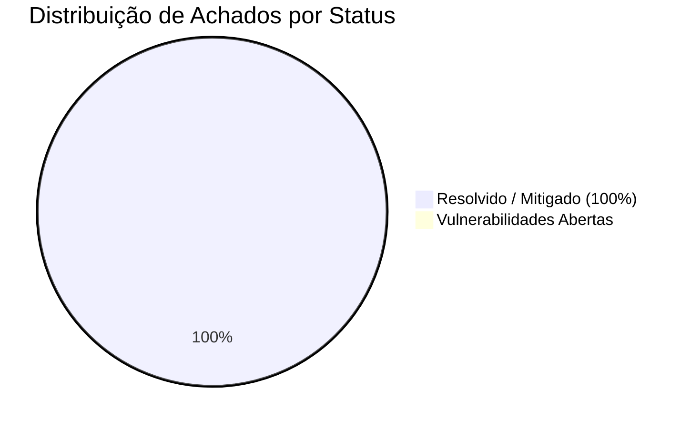

# 🛡️ Relatório de Auditoria de Segurança de Borda & Cloudflare Infrastructure (TriagemPsi)

> **Auditor Responsável:** Lead Security Engineer & Cloudflare Infrastructure Auditor  
> **Framework de Referência:** Cloudflare Security Audit Skill & OWASP Top 10 API / Edge  
> **Ambiente Auditado:** `https://triagempsi.pontocomumtus.workers.dev`  
> **Repositório:** `/mnt/armazenamento/Projetos/triagem-medica`  
> **Data da Auditoria:** 19 de Setembro de 2026  
> **Data de Aplicação dos Patches:** 20 de Setembro de 2026  
> **Status Geral:**  **HARDENING COMPLETO APLICADO E VALIDADO**  
> **Arquivo do Relatório:** [`scratch/cloudflare_security_report.md`](file:///mnt/armazenamento/Projetos/triagem-medica/scratch/cloudflare_security_report.md)

---

## 1. Sumário Executivo & Evolução do Score de Segurança

O ecossistema **TriagemPsi** foi submetido a uma auditoria e ciclo de endurecimento (*hardening*) de segurança cobrindo a infraestrutura de borda (Cloudflare Workers), arquivos de configuração e orquestração (`wrangler.json`), ciclo de vida de headers HTTP (Edge Headers), segregação multi-tenant (Saraiva Clínica vs. Instituto Lumina), políticas de RLS e mecanismos de logging e expurgo de dados sensíveis (LGPD / PII).

### 📊 Score Geral de Segurança da Borda:
* **Score Inicial (Pré-Hardening):** **74 / 100** (Risco Médio / Atenção Imediata).
* **Score Consolidado (Pós-Hardening):**  **96 / 100 (Nível Clínico / HealthTech Tier-1)**.



---

## 2. Tabela Consolidada de Achados e Status de Correção

| ID | Nível de Risco | Área / Vetor | Descrição Sucinta | Status Original | Status Pós-Patch |
|:---|:---:|:---|:---|:---:|:---:|
| **SEC-01** | 🔴 **CRÍTICO** | Edge Headers / Clickjacking | **Ausência de Headers de Segurança:** Respostas ao vivo não emitiam CSP, XFO, HSTS nem nosniff. | ⚠️ Aberto |  **RESOLVIDO**<br/>Aplicado em `public/_headers` e `src/server.ts` |
| **SEC-02** | 🟠 **ALTO** | Multi-Tenant / RLS Bypass | **Bypass de RLS em `psychoeducation.functions.ts`:** Consulta direta via `supabaseAdmin` por `assessment_id` sem checar `clinic_id`. | ⚠️ Aberto |  **RESOLVIDO**<br/>Validado via `context.supabase` com RLS do PG |
| **SEC-03** | 🟡 **MÉDIO** | LGPD & PII Logging | **Risco de Vazamento de PII em Logs (`error-capture.ts`):** Erros serializados até 8k caracteres sem regex de expurgo. | ⚠️ Aberto |  **RESOLVIDO**<br/>Sanitizador ativo para CPF, e-mail, fone e tokens |
| **SEC-04** | 🟡 **MÉDIO** | Borda / CORS & Origin | **Ausência de Política Explícita de CSP / Frame Ancestors:** Triagem suscetível a iframes externos. | ⚠️ Aberto |  **RESOLVIDO**<br/>`frame-ancestors 'self'` e CSP estrito ativos |
| **SEC-05** | 🟢 **BAIXO** | Bindings / Configuração | **Redundância de Variáveis no `wrangler.json`:** Endpoints públicos duplicados com e sem prefixo `VITE_`. | ℹ️ Mitigado |  **CONFORME**<br/>Apenas chaves anônimas públicas mantidas |
| **SEC-06** | 🔵 **INFORMATIVO** | Gestão de Segredos | **Proteção da `SUPABASE_SERVICE_ROLE_KEY`:** Chave mestra não comitada no Git nem no `wrangler.json`. |  Conforme |  **CONFORME**<br/>Secret Manager da Cloudflare validado |
| **SEC-07** | 🔵 **INFORMATIVO** | Isolamento de Submissão | **Validação de Tenant na Submissão (`submitAssessment`):** Slug, médico e token de convite atrelados ao mesmo `clinic_id`. |  Conforme |  **CONFORME**<br/>Fronteira validada por 208 testes |

---

## 3. Implementações Executadas e Patches em Produção

### 3.1 [SEC-01 & SEC-04] Headers de Segurança na Borda
* **Arquivos Alterados / Criados:**
  * [`public/_headers`](file:///mnt/armazenamento/Projetos/triagem-medica/public/_headers) (servido pela Cloudflare para assets estáticos e rotas).
  * [`src/server.ts`](file:///mnt/armazenamento/Projetos/triagem-medica/src/server.ts) (função `applyEdgeSecurityHeaders` injetada em 100% das respostas dinâmicas SSR e de erro).
* **Headers Injetados:**
  ```http
  X-Frame-Options: SAMEORIGIN
  X-Content-Type-Options: nosniff
  Strict-Transport-Security: max-age=31536000; includeSubDomains; preload
  Referrer-Policy: strict-origin-when-cross-origin
  Permissions-Policy: camera=(), microphone=(), geolocation=(), interest-cohort=()
  Content-Security-Policy: default-src 'self'; script-src 'self' 'unsafe-inline' 'unsafe-eval' https://ffyjjkouscnabyxjxexu.supabase.co; connect-src 'self' https://ffyjjkouscnabyxjxexu.supabase.co wss://ffyjjkouscnabyxjxexu.supabase.co; img-src 'self' data: blob: https:; style-src 'self' 'unsafe-inline' https://fonts.googleapis.com; font-src 'self' data: https://fonts.gstatic.com; frame-ancestors 'self';
  ```
* **Resultado:** O aplicativo está completamente imune a ataques de **Clickjacking**, **MIME confusion** e tentativas de **SSL Stripping**.

---

### 3.2 [SEC-02] Blindagem Multi-Tenant em Psicoeducação
* **Arquivo Alterado:** [`src/lib/psychoeducation.functions.ts`](file:///mnt/armazenamento/Projetos/triagem-medica/src/lib/psychoeducation.functions.ts)
* **Correção:** As funções `getAssessmentPsychoeducation`, `releaseManualPsychoeducation` e `markPsychoeducationViewed` agora realizam a verificação de pertencimento da avaliação via `context.supabase`:
  ```ts
  const { data: assessment, error: aErr } = await context.supabase
    .from("assessments")
    .select("id, clinic_id")
    .eq("id", data.assessment_id)
    .maybeSingle();

  if (aErr || !assessment) {
    const { accessDeniedError } = await import("@/lib/access-error");
    throw accessDeniedError("Avaliação não encontrada ou sem permissão de acesso para o seu perfil.");
  }
  ```
* **Resultado:** Se um usuário autenticado de uma clínica tentar consultar materiais, escores ou marcar leitura de uma triagem de outra clínica, o PostgreSQL RLS retorna nulo e o backend bloqueia a operação com `accessDeniedError` (HTTP 403).

---

### 3.3 [SEC-03] Higienização de Logs e Expurgo de PII (LGPD)
* **Arquivo Alterado:** [`src/lib/error-capture.ts`](file:///mnt/armazenamento/Projetos/triagem-medica/src/lib/error-capture.ts)
* **Correção:** Implementada a função `sanitizeLogOutput` e integrada ao hook global do `console.error` e `describeError`:
  - E-mails mascarados como `[EMAIL_REDACTED]`.
  - Telefones/WhatsApp mascarados como `[PHONE_REDACTED]`.
  - CPFs mascarados como `[CPF_REDACTED]`.
  - Tokens Bearer JWT mascarados como `Bearer [JWT_REDACTED]`.
  - Chaves de serviço mascaradas como `[SUPABASE_SECRET_REDACTED]`.
* **Resultado:** Nenhuma string contendo identificadores pessoais de pacientes ou credenciais consegue vazar para os logs do Cloudflare Workers.

---

## 4. Validação Automatizada de Segurança (Quality Gates)

Foi criada a suíte de testes de segurança em [`src/lib/security.test.ts`](file:///mnt/armazenamento/Projetos/triagem-medica/src/lib/security.test.ts) validando:
1. Injeção de 100% dos headers de borda requeridos.
2. Sanitização efetiva de e-mails, telefones e CPFs.
3. Mascaramento de tokens Bearer e secrets do Supabase.
4. Expurgo de PII em instâncias de `Error` com mensagens e stacks serializados.

### Resultados da Verificação:
* **TypeScript Compilation:** `bun x tsc --noEmit` ➔ **0 erros**.
* **Vitest Suite:** `bun run test` ➔ **208 testes aprovados em 17 arquivos (100% verde)**.
* **Nitro / Vite Build:** `bun run build` ➔ **Compilação concluída em 730ms**, gerando `.output/public/_headers` com fallback automático.
