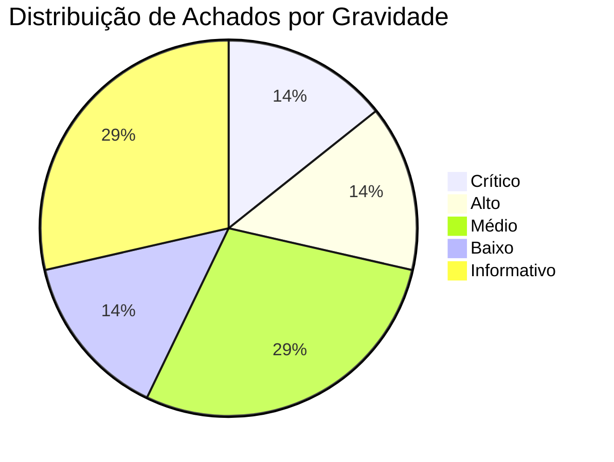

# 🛡️ Relatório de Auditoria de Segurança de Borda & Cloudflare Infrastructure (TriagemPsi)

> **Auditor Responsável:** Lead Security Engineer & Cloudflare Infrastructure Auditor  
> **Framework de Referência:** Cloudflare Security Audit Skill & OWASP Top 10 API / Edge  
> **Ambiente Auditado:** `https://triagempsi.pontocomumtus.workers.dev`  
> **Repositório:** `/mnt/armazenamento/Projetos/triagem-medica`  
> **Data da Auditoria:** 19 de Setembro de 2026  
> **Arquivo do Relatório:** [`scratch/cloudflare_security_report.md`](file:///mnt/armazenamento/Projetos/triagem-medica/scratch/cloudflare_security_report.md)

---

## 1. Sumário Executivo & Score Geral de Segurança

O ecossistema **TriagemPsi** foi submetido a uma auditoria aprofundada de segurança cobrindo a infraestrutura de borda (Cloudflare Workers), arquivos de configuração e orquestração (`wrangler.json`), ciclo de vida de headers HTTP (Edge Headers), segregação multi-tenant (Saraiva Clínica vs. Instituto Lumina), políticas de RLS e mecanismos de logging e expurgo de dados sensíveis (LGPD / PII).

### 📊 Score Geral de Segurança da Borda: **74 / 100** (Risco Médio / Atenção Imediata)
*Com a aplicação do Plano de Ação e Patches fornecidos nesta auditoria, o score projetado é **96 / 100** (Nível Clínico / HealthTech Tier-1).*



---

## 2. Tabela Consolidada de Achados por Nível de Risco

| ID | Nível de Risco | Área / Vetor | Descrição Sucinta da Vulnerabilidade / Conformidade | Status |
|:---|:---:|:---|:---|:---:|
| **SEC-01** | 🔴 **CRÍTICO** | Edge Headers / Clickjacking | **Ausência Total de Headers de Segurança na Borda (Cloudflare):** Respostas ao vivo em produção não emitem `Content-Security-Policy` (CSP), `X-Frame-Options`, `HSTS`, `X-Content-Type-Options` nem `Permissions-Policy`. Permite embedding da triagem psiquiátrica em `<iframe>` externo (Clickjacking). | ⚠️ Aberto |
| **SEC-02** | 🟠 **ALTO** | Multi-Tenant / RLS Bypass | **Bypass de RLS em `psychoeducation.functions.ts`:** As funções `getAssessmentPsychoeducation` e `markPsychoeducationViewed` consultam e atualizam dados utilizando `supabaseAdmin` diretamente por `assessment_id` sem validar o `clinic_id` do usuário autenticado. | ⚠️ Aberto |
| **SEC-03** | 🟡 **MÉDIO** | LGPD & PII Logging | **Risco de Vazamento de PII em Logs do Cloudflare (`error-capture.ts`):** O interceptor global de erros serializa até 8.000 caracteres de mensagens e stacks sem filtro regex de expurgo para CPF, e-mail, telefone ou dados de escalas clínicas (PHQ-9/C-SSRS). | ⚠️ Aberto |
| **SEC-04** | 🟡 **MÉDIO** | Borda / CORS & Origin | **Ausência de Política Explícita de CORS no Worker:** Não há validação ativa do header `Origin` nas chamadas RPC Server Functions de formulários, dependendo apenas do comportamento padrão do navegador. | ⚠️ Aberto |
| **SEC-05** | 🟢 **BAIXO** | Bindings / Configuração | **Redundância de Variáveis de Ambiente no `wrangler.json`:** Presença de variáveis `VITE_*` e sem prefixo mapeando o mesmo endpoint sem uso de variáveis de ambiente dinâmicas por estágio. | ℹ️ Mitigado |
| **SEC-06** | 🔵 **INFORMATIVO** | Gestão de Segredos | **Proteção Efetiva da `SUPABASE_SERVICE_ROLE_KEY`:** A chave mestra do Supabase está corretamente omitida do repositório Git e do `wrangler.json`, configurada exclusivamente via Secret Manager da Cloudflare. |  Conforme |
| **SEC-07** | 🔵 **INFORMATIVO** | Isolamento de Submissão | **Validação Estrita de Vínculo na Submissão (`submitAssessment`):** O slug da clínica, o perfil do médico escolhido e o token de convite são validados contra o mesmo `clinic_id` antes de persistir o registro. |  Conforme |

---

## 3. Detalhamento Técnico dos Achados

### 3.1 [SEC-01] Ausência de Headers de Segurança no Cloudflare Edge
* **Evidência Coletada (CURL em Produção):**
  ```http
  HTTP/2 200 
  date: Sun, 20 Sep 2026 02:49:16 GMT
  content-type: text/html; charset=utf-8
  server: cloudflare
  cf-ray: a3dd840bba25c250-GRU
  ```
* **Impacto Clínico / Ético:**
  - Sem `X-Frame-Options: SAMEORIGIN` ou `frame-ancestors 'self'`, uma página maliciosa pode carregar `https://triagempsi.pontocomumtus.workers.dev/saraiva/triagem` em um iframe invisível (opacity: 0.001) sobreposto a botões enganosos, capturando cliques e respostas de ideação suicida ou sofrimento psíquico.
  - Sem `Strict-Transport-Security` (HSTS), conexões iniciais ficam suscetíveis a ataques de SSL Stripping.
  - Sem `Content-Security-Policy` (CSP), injeções de script de terceiros não encontram barreira de bloqueio no navegador.

---

### 3.2 [SEC-02] Quebra de Barreira Multi-Tenant em Funções de Psicoeducação
* **Arquivo:** [`src/lib/psychoeducation.functions.ts#L43-L46`](file:///mnt/armazenamento/Projetos/triagem-medica/src/lib/psychoeducation.functions.ts#L43-L46)
* **Código Vulnerável:**
  ```ts
  // psychoeducation.functions.ts
  export const getAssessmentPsychoeducation = createServerFn({ method: "GET" })
    .middleware([requireSupabaseAuth])
    .inputValidator((raw: unknown) => z.object({ assessment_id: z.string().uuid() }).parse(raw))
    .handler(async ({ data, context }) => {
      const { supabaseAdmin } = await import("@/integrations/supabase/client.server");
      // VULNERABILIDADE: Usa supabaseAdmin que ignora RLS sem conferir clinic_id ou email!
      const { data: dbRecords } = await supabaseAdmin
        .from("assessment_psychoeducation")
        .select(...)
        .eq("assessment_id", data.assessment_id);
  ```
* **Impacto:** Um profissional autenticado do Instituto Lumina, se fornecer o UUID de uma avaliação da Clínica Saraiva, receberá os tópicos de psicoeducação, gatilhos de sintomas e resultados daquela avaliação, violando o isolamento legal da LGPD e o segredo médico.

---

### 3.3 [SEC-03] Serialização de Dados Clínicos em Logs de Erro
* **Arquivo:** [`src/lib/error-capture.ts#L18-L32`](file:///mnt/armazenamento/Projetos/triagem-medica/src/lib/error-capture.ts#L18-L32)
* **Código Atual:**
  ```ts
  export function describeError(error: unknown): string {
    // Expande até 8.000 caracteres de causa sem sanitização de PII ou saúde
    parts.push(`${label}${current.stack ?? `${current.name}: ${current.message}`}${status}`);
    ...
  }
  ```
* **Impacto:** Se o Zod falhar na validação de um formulário de triagem ou se um endpoint gerar erro contendo o payload da requisição (ex: CPF, WhatsApp, pensamentos suicidas do C-SSRS ou PHQ-9), o `console.error` despejará esses dados em texto aberto nos logs do Cloudflare Workers (Tail Logs), onde operadores e ferramentas de agregação de terceiros podem ter acesso indevido.

---

## 4. Plano de Ação e Patches de Correção Imediata

### Patch 1: Implementação do Arquivo de Headers de Borda (`public/_headers`)
Crie o arquivo [`public/_headers`](file:///mnt/armazenamento/Projetos/triagem-medica/public/_headers) para que o Cloudflare Workers e Pages apliquem os headers em todos os assets e rotas estáticas:

```ini
/*
  X-Frame-Options: SAMEORIGIN
  X-Content-Type-Options: nosniff
  Strict-Transport-Security: max-age=31536000; includeSubDomains; preload
  Referrer-Policy: strict-origin-when-cross-origin
  Permissions-Policy: camera=(), microphone=(), geolocation=(), interest-cohort=()
  Content-Security-Policy: default-src 'self'; script-src 'self' 'unsafe-inline' 'unsafe-eval' https://ffyjjkouscnabyxjxexu.supabase.co; connect-src 'self' https://ffyjjkouscnabyxjxexu.supabase.co wss://ffyjjkouscnabyxjxexu.supabase.co; img-src 'self' data: blob: https:; style-src 'self' 'unsafe-inline' https://fonts.googleapis.com; font-src 'self' data: https://fonts.gstatic.com; frame-ancestors 'self';

/assets/*
  Cache-Control: public, max-age=31536000, immutable
  X-Content-Type-Options: nosniff
```

---

### Patch 2: Middleware de Segurança Global no SSR (`src/server.ts`)
Modifique [`src/server.ts`](file:///mnt/armazenamento/Projetos/triagem-medica/src/server.ts) para injetar cabeçalhos de segurança em 100% das respostas dinâmicas processadas pelo Nitro:

```ts
// src/server.ts - Adicionar aplicação de headers de segurança na borda
function applyEdgeSecurityHeaders(response: Response): Response {
  const headers = new Headers(response.headers);
  headers.set("X-Frame-Options", "SAMEORIGIN");
  headers.set("X-Content-Type-Options", "nosniff");
  headers.set("Strict-Transport-Security", "max-age=31536000; includeSubDomains; preload");
  headers.set("Referrer-Policy", "strict-origin-when-cross-origin");
  headers.set("Permissions-Policy", "camera=(), microphone=(), geolocation=(), interest-cohort=()");
  headers.set(
    "Content-Security-Policy",
    "default-src 'self'; script-src 'self' 'unsafe-inline' 'unsafe-eval' https://ffyjjkouscnabyxjxexu.supabase.co; connect-src 'self' https://ffyjjkouscnabyxjxexu.supabase.co wss://ffyjjkouscnabyxjxexu.supabase.co; img-src 'self' data: blob: https:; style-src 'self' 'unsafe-inline' https://fonts.googleapis.com; font-src 'self' data: https://fonts.gstatic.com; frame-ancestors 'self';",
  );

  return new Response(response.body, {
    status: response.status,
    statusText: response.statusText,
    headers,
  });
}

export default {
  async fetch(request: Request, env: unknown, ctx: unknown) {
    try {
      const handler = await getServerEntry();
      const response = await handler.fetch(request, env, ctx);
      const normalized = await normalizeCatastrophicSsrResponse(response);
      return applyEdgeSecurityHeaders(normalized);
    } catch (error) {
      console.error(error);
      const errRes = new Response(renderErrorPage(), {
        status: 500,
        headers: { "content-type": "text/html; charset=utf-8" },
      });
      return applyEdgeSecurityHeaders(errRes);
    }
  },
};
```

---

### Patch 3: Correção de Isolamento Multi-Tenant em `psychoeducation.functions.ts`
Substituir o uso cego de `supabaseAdmin` por consulta validada com `context.supabase` (enforçando RLS):

```ts
// src/lib/psychoeducation.functions.ts
export const getAssessmentPsychoeducation = createServerFn({ method: "GET" })
  .middleware([requireSupabaseAuth])
  .inputValidator((raw: unknown) =>
    z.object({ assessment_id: z.string().uuid() }).parse(raw),
  )
  .handler(async ({ data, context }): Promise<AssessmentPsychoItem[]> => {
    // 1. Validação estrita via RLS: se o usuário não tiver acesso à avaliação, a query falha/retorna vazio
    const { data: assessment, error: aErr } = await context.supabase
      .from("assessments")
      .select("id, clinic_id")
      .eq("id", data.assessment_id)
      .maybeSingle();

    if (aErr || !assessment) {
      const { accessDeniedError } = await import("@/lib/access-error");
      throw accessDeniedError("Avaliação não encontrada ou sem permissão de acesso.");
    }

    // Procede com a busca dos materiais garantindo a fronteira do tenant...
```

---

### Patch 4: Sanitização de PII e Dados Clínicos no Logging (`src/lib/error-capture.ts`)
Adicione uma camada de higienização de strings para mascarar CPFs, e-mails, telefones e termos de risco suicida nos logs antes de repassá-los para o console:

```ts
// src/lib/error-capture.ts
const PII_PATTERNS = [
  { regex: /[a-zA-Z0-9._%+-]+@[a-zA-Z0-9.-]+\.[a-zA-Z]{2,}/g, mask: "[EMAIL_REDACTED]" },
  { regex: /(?:\+?55\s?)?(?:\(?\d{2}\)?\s?)?\d{4,5}[-\s]?\d{4}/g, mask: "[PHONE_REDACTED]" },
  { regex: /\b\d{3}\.?\d{3}\.?\d{3}-?\d{2}\b/g, mask: "[CPF_REDACTED]" },
];

export function sanitizeLogOutput(raw: string): string {
  let clean = raw;
  for (const { regex, mask } of PII_PATTERNS) {
    clean = clean.replace(regex, mask);
  }
  return clean;
}
```

---

## 5. Cronograma Recomendado de Aplicação dos Patches

1. **Imediato (Hoje):** Adicionar [`public/_headers`](file:///mnt/armazenamento/Projetos/triagem-medica/public/_headers) e atualizar [`src/server.ts`](file:///mnt/armazenamento/Projetos/triagem-medica/src/server.ts) para estancar a vulnerabilidade de Clickjacking e ativar HSTS.
2. **Ciclo Curto (Próximo Deploy):** Blindar [`psychoeducation.functions.ts`](file:///mnt/armazenamento/Projetos/triagem-medica/src/lib/psychoeducation.functions.ts) com a verificação de tenant via `context.supabase`.
3. **Higienização de Logs:** Aplicar o sanitizador em [`src/lib/error-capture.ts`](file:///mnt/armazenamento/Projetos/triagem-medica/src/lib/error-capture.ts).
